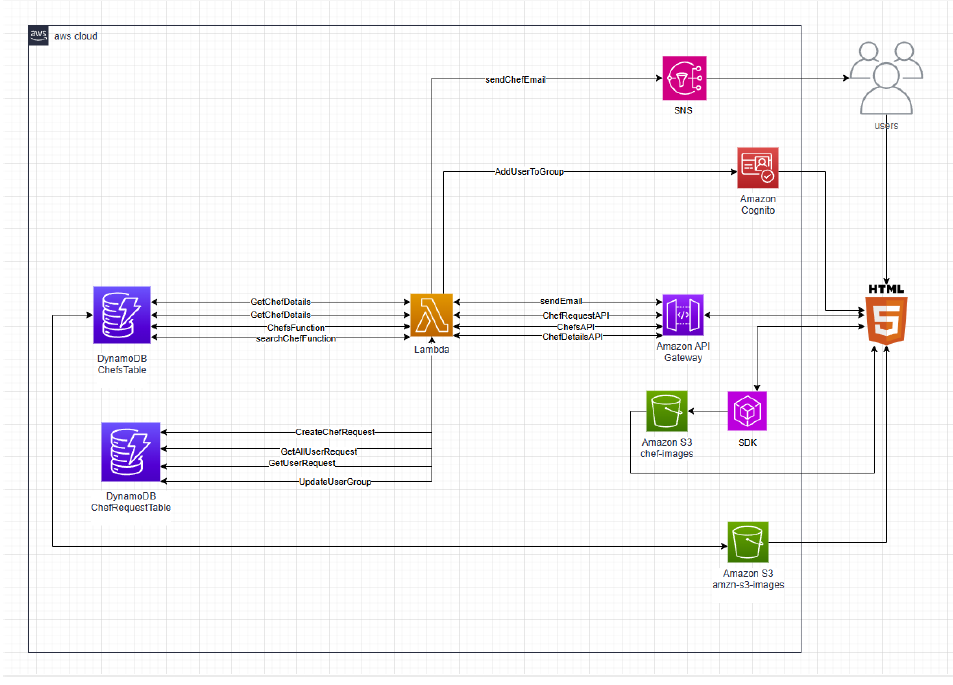
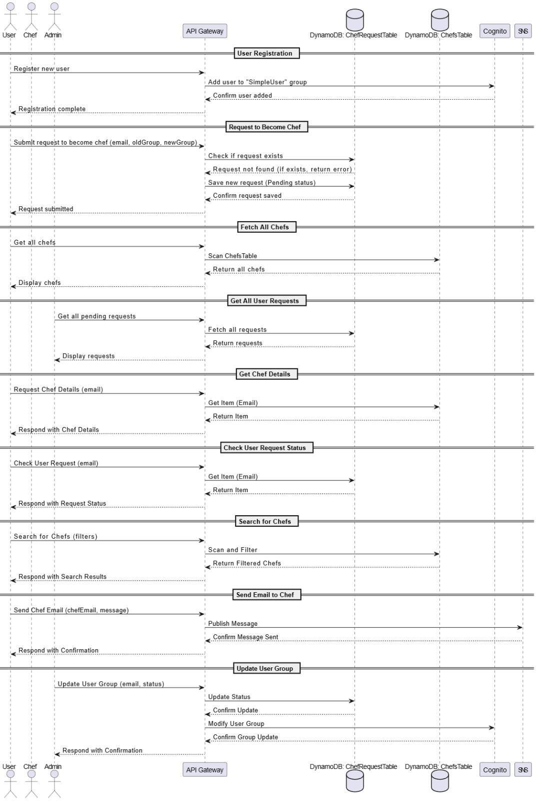

# 🍽 ChefMatch – Private Chef Booking Platform

ChefMatch is a full-stack web platform that connects private chefs with customers seeking unforgettable culinary experiences for their private events. The system supports role-based access, dynamic chef discovery, and secure messaging—all powered by AWS cloud services.

---

## 📌 Project Overview

ChefMatch allows:
- Users to search and contact private chefs based on name, category, or price.
- Users to request upgrading their role to "Chef" and create a personal chef profile.
- Admins to approve or reject chef conversion requests.
- Chefs to receive contact emails from users.
  
The platform is built using **HTML, CSS, JavaScript** on the frontend, and **AWS Lambda, DynamoDB, S3, Cognito, API Gateway, SNS** on the backend.

---

## 🧱 System Architecture
The diagram below illustrates the AWS cloud architecture designed for the ChefMatch platform, following serverless and scalable best practices.

  

### 🗂 Amazon DynamoDB
- `ChefsTable`: Stores chef details.
- `ChefRequestTable`: Tracks user requests to become a chef.

### 🖼 Amazon S3
- `chefs-images`: Stores chef profile images.
- `chefmatch-project-files`: Hosts the project files (e.g., static web assets).

### 👥 Amazon Cognito
- Manages user authentication and roles:
  - `SimpleUser`: Default role
  - `ChefUser`: Chef role with additional privileges
  - `Admin`: Admins who manage user upgrades

### ⚙ AWS Lambda Functions
- `AddUserToGroup`: Adds new users to the default group.
- `CreateChefRequest`: Submits request to become a chef.
- `GetUserRequest`: Checks request status.
- `GetAllUserRequest`: Admin fetches all requests.
- `UpdateUserGroup`: Admin approves/rejects chef requests.
- `ChefsFunction`: Retrieves all chefs.
- `searchChefsFunction`: Searches chefs by criteria.
- `GetChefDetails`: Fetches a specific chef’s profile.
- `sendChefEmail`: Sends email to a selected chef.

### 📡 Amazon SNS
- Used for sending emails to chefs (alternative to SES due to lab limitations).

### 🌐 Amazon API Gateway
Connects HTTP requests from the frontend to the corresponding Lambda functions.

---

## 💻 Frontend Pages

| File               | Description                             |
|--------------------|-----------------------------------------|
| `index.html`       | Landing page                            |
| `chefs.html`       | Displays all chefs                      |
| `chefDetails.html` | Individual chef profile                 |
| `admin.html`       | Admin dashboard                         |
| `addChefDetails.html` | Create chef profile page            |

### Key JavaScript Files
- `main.js`: Base template logic
- `loginAws.js`: User authentication and page routing
- `userToChef.js`: Chef conversion logic
- `chefs.js`: Display and filter chefs
- `chefDetails.js`: Load individual chef data
- `admin.js`: Admin request management
- `addChefDetails.js`: Chef profile creation logic

---

## 🎨 User Interface Design

- Responsive top navigation bar with dynamic menu options based on user role.
- Green box (`body`) changes content based on page and user role.
- SimpleUser: Search chefs, request to become a chef.
- ChefUser: Access to create chef profile.
- Admin: Approve/reject chef requests.

---

## 🧪 Demo & Testing

### Test Users

| Role        | Email                       | Password        |
|-------------|-----------------------------|-----------------|
| Admin       | eladaharon066@gmail.com          | `1!Qazwsx`   |
| Chef        | rotemros12@gmail.com        | `q1w2e3r4t5R!`   |
| SimpleUser  | cybot1231@gmail.com         | `q1w2e3r4t5R!`   |

### Online Demo
- 🔗 [Live App](https://chefmatch-project-files.s3.us-east-1.amazonaws.com/index.html)

---

## 🔧 Installation & Deployment

> **Note**: The app is fully serverless and hosted via AWS. You can run it by uploading the static site to S3 and deploying Lambda functions using the AWS Management Console or CloudFormation.

To deploy from scratch:
1. Clone the repo:  
   `git clone https://github.com/RotemRosenberg/ChefMatch-Git.git`
2. Deploy frontend files to S3.
3. Create Cognito user pool and identity pool.
4. Set up DynamoDB tables (`ChefsTable`, `ChefRequestTable`).
5. Deploy Lambda functions and connect them to API Gateway.
6. Configure permissions and SNS topic manually for email.

---

## 📦 Repository

- GitHub: [ChefMatch GitHub Repository](https://github.com/RotemRosenberg/ChefMatch-Git.git)

---

## ✉️ Contact

For questions or contributions, contact:  
📧 [eladaharon065@gmail.com](mailto:eladaharon065@gmail.com)

---

